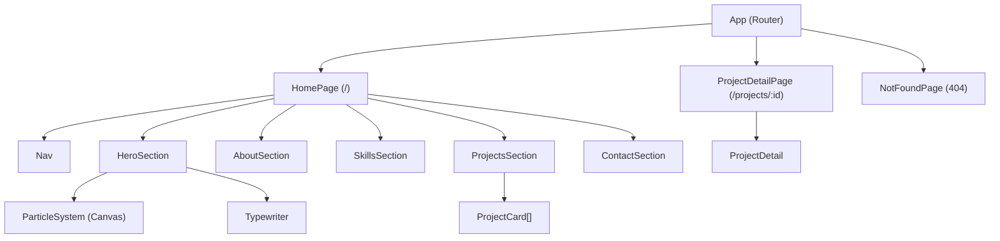
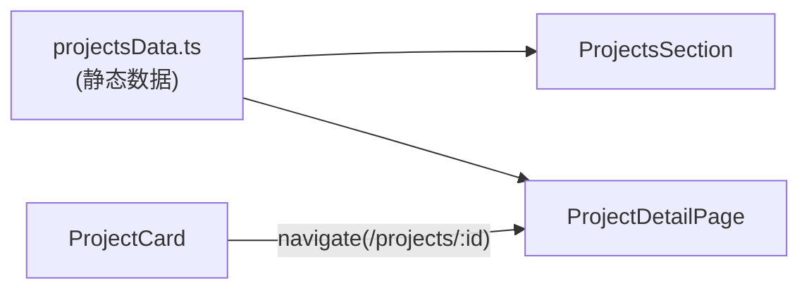

# Design Document: Personal Portal

## Overview

Personal Portal 是一个基于 React 构建的个人展示网站，采用科幻风格视觉设计。核心目标是通过粒子特效、光效动画、打字机动效等交互元素，为访客提供沉浸式的浏览体验，同时清晰展示个人信息、技能与项目作品。

技术栈：
- React 18 + React Router v6（SPA 路由）
- CSS Modules 或 Tailwind CSS（样式隔离）
- Canvas API（粒子系统）
- Intersection Observer API（滚动触发动画）
- Web Animations API / CSS Transitions（动效）

设计原则：
- 移动端优先：粒子系统在移动端禁用，保证性能
- 渐进增强：核心内容在无 JS 环境下仍可读
- 动效克制：所有过渡时长控制在 150ms–800ms

---

## Architecture



### 数据流



静态数据（项目列表、技能列表）以 TypeScript 常量形式存储在 `src/data/` 目录，无需后端。

---

## Components and Interfaces

### App

```
<App>
  <Router>
    <Nav />
    <Routes>
      <Route path="/" element={<HomePage />} />
      <Route path="/projects/:id" element={<ProjectDetailPage />} />
      <Route path="*" element={<NotFoundPage />} />
    </Routes>
  </Router>
</App>
```

### Nav

- Props: 无（内部通过 `useScrollSpy` hook 获取当前 section）
- 行为：
  - `position: fixed; top: 0`
  - 滚动超过 80px 时添加 `backdrop-filter: blur(12px)` 毛玻璃背景
  - 点击链接触发 `scrollIntoView({ behavior: 'smooth' })`
  - 当前 section 对应导航项高亮
  - 悬停时显示青色下划线扫光动效（CSS `::after` + `transform: scaleX`）

### HeroSection

- Props: 无
- 子组件：`ParticleSystem`、`Typewriter`
- 行为：
  - 高度 `100vh`
  - 包含姓名、动态职位文字、CTA 按钮
  - CTA 按钮点击后 `scrollIntoView` 至 AboutSection

### ParticleSystem

```typescript
interface ParticleSystemProps {
  particleCount?: number; // 默认 80
  disabled?: boolean;     // 移动端传 true
}
```

- 使用 `<canvas>` 渲染，`requestAnimationFrame` 驱动动画循环
- 每个粒子维护位置、速度、透明度状态
- 监听 `mousemove` 事件，计算粒子与鼠标距离，施加吸引/排斥力
- 移动端（`disabled=true`）渲染静态 CSS 渐变背景替代

### Typewriter

```typescript
interface TypewriterProps {
  texts: string[];        // 循环显示的文字列表
  charInterval?: number;  // 每字间隔，默认 80ms（≤100ms）
  pauseDuration?: number; // 完成后暂停，默认 2000ms
}
```

- 内部状态：`currentTextIndex`、`displayedText`、`isDeleting`
- 使用 `useEffect` + `setTimeout` 驱动状态机

### SkillsSection

```typescript
interface Skill {
  name: string;
  category: string;
  proficiency?: number; // 0–100，可选
  icon?: string;
}
```

- 使用 `useIntersectionObserver` hook 触发入场动画
- 每张卡片 `animation-delay: index * 80ms`
- 悬停时 `box-shadow: 0 0 12px #00ffff`（150ms transition）
- 有 `proficiency` 时渲染进度条，入场时从 0 动画至目标值

### ProjectsSection

```typescript
interface Project {
  id: string;
  name: string;
  description: string;   // ≤120 字
  tags: string[];
  thumbnail?: string;
  fullDescription?: string;
  techStack: string[];
  demoUrl?: string;
  screenshots?: string[];
}
```

- 卡片网格：`grid-template-columns: repeat(auto-fill, minmax(280px, 1fr))`（每行 ≥2 列）
- 交错淡入：`animation-delay: index * 100ms`
- 悬停：`transform: translateY(-4px)` + 增强 `box-shadow`
- 点击导航至 `/projects/:id`

### ProjectDetailPage

- 从 `useParams` 获取 `id`，在静态数据中查找
- 找不到时渲染 404 提示 + 返回首页链接
- 入场动画：内容 `translateY(20px) → translateY(0)` + `opacity: 0 → 1`

### AboutSection

- 展示头像、简介、所在地、当前状态
- 入场时标题触发 Glitch Effect（CSS `@keyframes` 随机偏移 + 颜色通道分离）
- 简介文字逐行淡入（每行 `animation-delay` 递增）

### ContactSection

- 展示 Email、GitHub、LinkedIn 等图标链接
- 悬停：图标 `scale(1.2)` + `filter: drop-shadow(0 0 8px #00ffff)`（200ms）
- Email 链接使用 `mailto:` 协议

### 全局视觉层

- `ScanLine` 组件：全屏 `position: fixed` 伪元素，`repeating-linear-gradient` 模拟 CRT 扫描线，`pointer-events: none`
- 全局 CSS 变量：
  ```css
  --bg-primary: #0a0a0f;
  --accent-cyan: #00ffff;
  --accent-blue: #0080ff;
  --font-mono: 'JetBrains Mono', 'Fira Code', monospace;
  ```

---

## Data Models

### Project

```typescript
interface Project {
  id: string;              // URL slug，如 "my-project"
  name: string;
  description: string;     // 列表页简短描述，≤120 字
  tags: string[];          // 技术标签
  thumbnail?: string;      // 列表页缩略图路径
  techStack: string[];     // 详情页技术栈列表
  fullDescription?: string;// 详情页完整描述
  demoUrl?: string;        // 演示链接
  screenshots?: string[];  // 截图路径列表
}
```

### Skill

```typescript
interface Skill {
  id: string;
  name: string;
  category: string;        // 如 "Frontend"、"Backend"、"DevOps"
  proficiency?: number;    // 0–100
  icon?: string;           // 图标路径或 emoji
}
```

### NavItem

```typescript
interface NavItem {
  label: string;
  sectionId: string;       // 对应 section 的 DOM id
}
```

### ParticleState（内部）

```typescript
interface Particle {
  x: number;
  y: number;
  vx: number;              // x 方向速度
  vy: number;              // y 方向速度
  radius: number;
  opacity: number;
  color: string;
}
```

---

## Correctness Properties

*A property is a characteristic or behavior that should hold true across all valid executions of a system — essentially, a formal statement about what the system should do. Properties serve as the bridge between human-readable specifications and machine-verifiable correctness guarantees.*

### Property 1: 粒子数量下限

*For any* ParticleSystem 实例，当 `particleCount` 参数 ≥ 80 时，初始化后内部粒子数组的长度应等于 `particleCount`，且不少于 80。

**Validates: Requirements 2.2**

---

### Property 2: 鼠标交互影响粒子速度

*For any* 粒子集合和任意鼠标位置，触发 mousemove 事件后，距离鼠标位置在影响半径内的粒子，其速度向量（vx, vy）应与事件前不同（即鼠标位置对粒子施加了力）。

**Validates: Requirements 2.3**

---

### Property 3: 打字机字符间隔约束

*For any* 传入 Typewriter 的文字列表，每次新增一个字符的时间间隔应不超过 100ms（即 `charInterval ≤ 100`）。

**Validates: Requirements 2.4**

---

### Property 4: 打字机循环播放

*For any* 包含 N 段文字的列表，Typewriter 状态机在完成第 N 段文字并删除后，应回到第 0 段文字重新开始打字，形成循环。

**Validates: Requirements 2.5**

---

### Property 5: 导航栏滚动状态

*For any* 滚动距离 > 80px 的页面状态，Nav 组件应具有毛玻璃背景样式类（即 `backdrop-filter: blur` 生效）；当滚动距离 ≤ 80px 时，该样式类不应存在。

**Validates: Requirements 3.2**

---

### Property 6: 导航项高亮与当前 Section 一致

*For any* 当前激活的 sectionId，Nav 中对应该 sectionId 的导航项应具有高亮样式类，其余导航项不应具有高亮样式类。

**Validates: Requirements 3.4**

---

### Property 7: 技能列表完整渲染

*For any* 技能数据数组，SkillsSection 渲染后 DOM 中的技能卡片数量应等于数组长度，且每张卡片包含对应技能的名称。

**Validates: Requirements 4.1**

---

### Property 8: 卡片交错入场延迟

*For any* 包含 N 个元素的列表（技能卡片或项目卡片），第 i 张卡片（0-indexed）的 `animation-delay` 应等于 `i * delay_step`（技能卡片 80ms，项目卡片 100ms）。

**Validates: Requirements 4.2, 5.2**

---

### Property 9: 有熟练度数据的技能渲染进度条

*For any* 包含 `proficiency` 字段（0–100）的技能，SkillsSection 中对应卡片应渲染进度条元素，且进度条的目标宽度比例等于 `proficiency / 100`。

**Validates: Requirements 4.4**

---

### Property 10: 项目卡片完整展示必要信息

*For any* 项目数据对象，ProjectsSection 中对应卡片应同时展示项目名称、描述文字、以及至少一个技术标签。

**Validates: Requirements 5.5**

---

### Property 11: 项目卡片点击导航至正确路由

*For any* 项目数据对象（id 为任意合法字符串），点击对应项目卡片后，路由应跳转至 `/projects/{id}`。

**Validates: Requirements 5.4**

---

### Property 12: 项目详情页展示完整信息

*For any* 存在于数据源中的项目，访问 `/projects/:id` 时，页面应同时展示项目标题、完整描述、技术栈列表，以及演示链接或截图（若数据存在）。

**Validates: Requirements 6.2**

---

### Property 13: 无效项目 ID 显示 404

*For any* 不存在于数据源中的项目 ID，访问 `/projects/:id` 时，页面应渲染 404 提示文字，并包含指向首页（`/`）的链接。

**Validates: Requirements 6.5**

---

### Property 14: 简介文字逐行淡入延迟

*For any* 包含 N 行简介文字的 AboutSection，第 i 行（0-indexed）的 `animation-delay` 应大于第 i-1 行，形成递增的交错延迟。

**Validates: Requirements 7.3**

---

### Property 15: 所有 Section 使用 IntersectionObserver 触发动画

*For any* 实现了入场动画的 Section 组件（About、Skills、Projects、Contact），在未进入视口时不应具有"已激活"动画类；进入视口后应具有该类。

**Validates: Requirements 9.1**

---

### Property 16: 动画时长在合法范围内

*For any* 页面中定义了 CSS transition 或 animation duration 的元素，其时长值应在 150ms 至 800ms 之间（含边界）。

**Validates: Requirements 9.2**

---

### Property 17: 移动端禁用粒子系统

*For any* 移动端视口（如 `window.innerWidth < 768` 或 `matchMedia` 检测为触摸设备），ParticleSystem 的 `disabled` prop 应为 `true`，Canvas 元素不应被渲染，静态渐变背景应替代显示。

**Validates: Requirements 9.3**

---

## Error Handling

### 路由 404

- `ProjectDetailPage` 在数据查找失败时渲染内联 404 UI，不抛出异常
- `NotFoundPage` 处理所有未匹配路由（`path="*"`）

### 粒子系统

- Canvas 不支持时（极少数环境）：`try/catch` 获取 2D context，失败则降级为静态背景
- `requestAnimationFrame` 在组件卸载时通过 `cancelAnimationFrame` 清理，防止内存泄漏

### 图片资源

- 项目截图/头像使用 `onError` 回调，加载失败时显示占位符

### 数据边界

- `proficiency` 值在渲染前 `clamp(0, 100)` 处理，防止进度条溢出
- 项目描述超过 120 字时在 UI 层截断并加省略号（`text-overflow: ellipsis` 或 JS slice）

---

## Testing Strategy

### 双轨测试方法

本项目采用单元测试 + 属性测试的互补策略：

- **单元测试**：验证具体示例、边界条件、组件结构（使用 Vitest + React Testing Library）
- **属性测试**：验证普遍性质，覆盖大量随机输入（使用 fast-check）

### 单元测试覆盖点

- Nav 组件：`position: fixed` 样式、毛玻璃类在滚动 > 80px 时存在
- HeroSection：包含姓名、CTA 按钮、Typewriter 组件
- ProjectDetailPage：路由 `/projects/:id` 渲染正确组件；无效 ID 渲染 404
- ContactSection：Email 链接使用 `mailto:` 协议；至少一个联系方式存在
- AboutSection：渲染头像、简介、关键信息元素
- 全局：CSS 变量 `--bg-primary`、`--accent-cyan`、`--font-mono` 已定义

### 属性测试覆盖点（fast-check，每个属性最少 100 次迭代）

每个属性测试必须在注释中标注对应设计属性：

```
// Feature: personal-portal, Property 1: 粒子数量下限
```

| 属性编号 | 测试描述 | 生成器策略 |
|---------|---------|-----------|
| Property 1 | 任意 particleCount ≥ 80，粒子数组长度等于 particleCount | `fc.integer({ min: 80, max: 500 })` |
| Property 2 | 任意鼠标坐标，影响半径内粒子速度发生变化 | `fc.record({ x: fc.float(), y: fc.float() })` |
| Property 3 | 任意文字列表，charInterval ≤ 100 | `fc.array(fc.string(), { minLength: 1 })` |
| Property 4 | 任意 N 段文字，状态机最终循环回第 0 段 | `fc.array(fc.string(), { minLength: 2, maxLength: 10 })` |
| Property 5 | 任意滚动值 > 80，Nav 具有毛玻璃类 | `fc.integer({ min: 81, max: 10000 })` |
| Property 6 | 任意 sectionId，仅对应导航项高亮 | `fc.constantFrom(...navItems.map(n => n.sectionId))` |
| Property 7 | 任意技能数组，卡片数量等于数组长度 | `fc.array(arbitrarySkill, { minLength: 0, maxLength: 50 })` |
| Property 8 | 任意 N 个卡片，第 i 张延迟 = i * step | `fc.array(fc.anything(), { minLength: 1, maxLength: 20 })` |
| Property 9 | 任意有 proficiency 的技能，渲染进度条且宽度正确 | `fc.record({ proficiency: fc.integer({ min: 0, max: 100 }) })` |
| Property 10 | 任意项目对象，卡片包含 name、description、tags | `fc.record({ id: fc.string(), name: fc.string(), ... })` |
| Property 11 | 任意项目 id，点击卡片路由跳转至 /projects/:id | `fc.string({ minLength: 1 })` |
| Property 12 | 任意存在的项目，详情页展示所有必要字段 | 从 projectsData 中随机选取 |
| Property 13 | 任意不存在的 id，渲染 404 + 首页链接 | `fc.string().filter(id => !projectsData.find(p => p.id === id))` |
| Property 14 | 任意 N 行简介，第 i 行延迟 > 第 i-1 行 | `fc.array(fc.string(), { minLength: 2, maxLength: 10 })` |
| Property 15 | 任意 Section，未进入视口时无激活类，进入后有激活类 | Mock IntersectionObserver |
| Property 16 | 任意动画元素，duration 在 [150, 800]ms | 遍历所有 CSS 规则 |
| Property 17 | 任意移动端视口宽度，ParticleSystem disabled=true | `fc.integer({ min: 320, max: 767 })` |

### 测试工具配置

```json
{
  "devDependencies": {
    "vitest": "^1.x",
    "@testing-library/react": "^14.x",
    "@testing-library/user-event": "^14.x",
    "fast-check": "^3.x",
    "jsdom": "^24.x"
  }
}
```

每个属性测试运行最少 100 次迭代：

```typescript
fc.assert(fc.property(...generators, (input) => {
  // test body
}), { numRuns: 100 });
```
